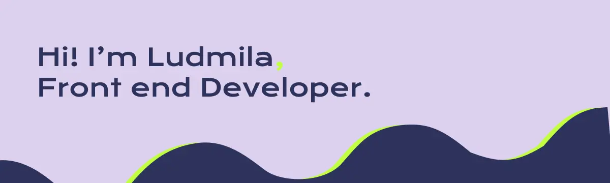

# My Front End Portfolio :sparkles:

## Visit my portfolio [Here](https://ludmila-niecz.vercel.app)

## Visita mi portfolio [Aquí](https://ludmila-niecz.vercel.app)

---

### Features

- Responsive design (mobile - tablet - desktop).
- 2 languages (english - spanish).
- Animations.
- Lazy load images.
- Suitable images sizes depending on the viewport.
- Preload assets (fonts) and style for fast painting (LCP - FPC).
- Code splitting

### Caracteristicas

- Diseño adaptable para distintos dispositivos (mobile - tablet - desktop).
- 2 idiomas (inglés - español).
- Animaciones.
- Carga diferida de imagenes.
- Tamaño de images apropiadas segun el viewport.
- Precarga de recursos como fuentes y estilos para un pintado más rápido (LCP - FCP)
- División de código.

---

### Technologies
:sparkles: React.js

:sparkles: React Hooks

:sparkles: Styled-Components

:sparkles: GSAP

:sparkles: React Router

*Working on a server-side version, styled with Sass*